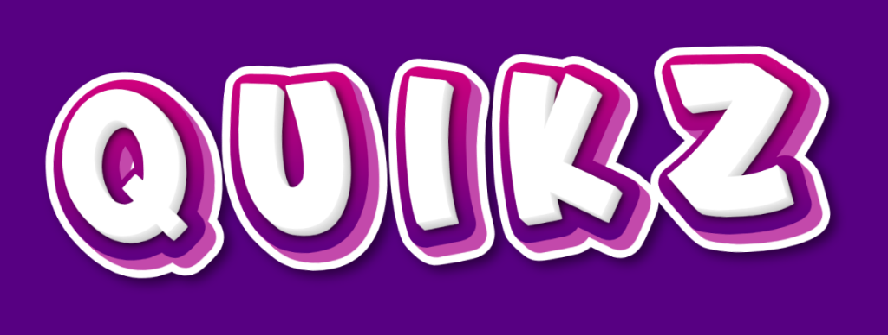

<p align="center">
	
</p>
<p align="center">
	<em><code>❯ Quikz — a vocabulary learning service using flashcards and more.</code></em>
</p>
<p align="center">
	
	
	
	
</p>
<p align="center">Built with the tools and technologies:</p>
<p align="center">
	
	
	
</p>
<br>

##  Table of Contents

- [ Overview](#-overview)
- [ Features](#-features)
- [ Project Structure](#-project-structure)
  - [ Project Index](#-project-index)
- [ Getting Started](#-getting-started)
  - [ Prerequisites](#-prerequisites)
  - [ Installation](#-installation)
  - [ Usage](#-usage)
  - [ Testing](#-testing)
- [ Project Roadmap](#-project-roadmap)
- [ Contributing](#-contributing)
- [ License](#-license)
- [ Acknowledgments](#-acknowledgments)

---

##  Overview

**Quikz** is a vocabulary learning tool designed to help users expand their word knowledge using digital **flashcards**, spaced repetition techniques, quizzes, and daily learning goals.

It supports multiple languages and is ideal for language learners, students, and anyone who wants to improve their vocabulary retention.

---

##  Features

- 📚 **Flashcard-based learning** — Add, edit, and review vocabulary cards.
- ⏰ **Spaced repetition** — Cards resurface over time for long-term retention.
- 📊 **Progress tracking** — Monitor learning progress with stats.
- 🌍 **Multi-language support** — Learn words in different languages.
- 💬 **Example sentences** — Each word includes context to help memorization.
- 🧠 **Quiz mode** — Test your memory and reinforce learning.

---

##  Project Structure

```sh
└── Quikz/
    └── backend
        ├── build.gradle.kts
        ├── gradle
        ├── gradlew
        ├── gradlew.bat
        ├── settings.gradle.kts
        └── src
```

---
##  Getting Started

###  Prerequisites

Before getting started with Quikz, ensure your runtime environment meets the following requirements:

- **Programming Language:** Java
- **Package Manager:** Gradle


###  Installation

Install Quikz using one of the following methods:

**Build from source:**

1. Clone the Quikz repository:
```sh
❯ git clone https://github.com/ItsTonTony/Quikz
```

2. Navigate to the project directory:
```sh
❯ cd Quikz/backend
```

3. Install the project dependencies:


**Using `gradle`** &nbsp; [](https://gradle.org/)

```sh
❯ gradle build
```


###  Usage
Run Quikz using the following command:
**Using `gradle`** &nbsp; [](https://gradle.org/)

```sh
❯ gradle run
```


###  Testing
Run the test suite using the following command:
**Using `gradle`** &nbsp; [](https://gradle.org/)

```sh
❯ gradle test
```


---
##  Project Roadmap

- [X] **`Task 1`**: <strike>Implement feature one.</strike>
- [ ] **`Task 2`**: Implement feature two.
- [ ] **`Task 3`**: Implement feature three.

---

##  Contributing

- **💬 [Join the Discussions](https://github.com/ItsTonTony/Quikz/discussions)**: Share your insights, provide feedback, or ask questions.
- **🐛 [Report Issues](https://github.com/ItsTonTony/Quikz/issues)**: Submit bugs found or log feature requests for the `Quikz` project.
- **💡 [Submit Pull Requests](https://github.com/ItsTonTony/Quikz/blob/main/CONTRIBUTING.md)**: Review open PRs, and submit your own PRs.

<details closed>
<summary>Contributing Guidelines</summary>

1. **Fork the Repository**: Start by forking the project repository to your github account.
2. **Clone Locally**: Clone the forked repository to your local machine using a git client.
   ```sh
   git clone https://github.com/ItsTonTony/Quikz
   ```
3. **Create a New Branch**: Always work on a new branch, giving it a descriptive name.
   ```sh
   git checkout -b new-feature-x
   ```
4. **Make Your Changes**: Develop and test your changes locally.
5. **Commit Your Changes**: Commit with a clear message describing your updates.
   ```sh
   git commit -m 'Implemented new feature x.'
   ```
6. **Push to github**: Push the changes to your forked repository.
   ```sh
   git push origin new-feature-x
   ```
7. **Submit a Pull Request**: Create a PR against the original project repository. Clearly describe the changes and their motivations.
8. **Review**: Once your PR is reviewed and approved, it will be merged into the main branch. Congratulations on your contribution!
</details>

<details closed>
<summary>Contributor Graph</summary>
<br>
<p align="left">
   <a href="https://github.com{/ItsTonTony/Quikz/}graphs/contributors">
      
   </a>
</p>
</details>

---

##  License

This project is protected under the [SELECT-A-LICENSE](https://choosealicense.com/licenses) License. For more details, refer to the [LICENSE](https://choosealicense.com/licenses/) file.

---

##  Acknowledgments

- List any resources, contributors, inspiration, etc. here.

---
